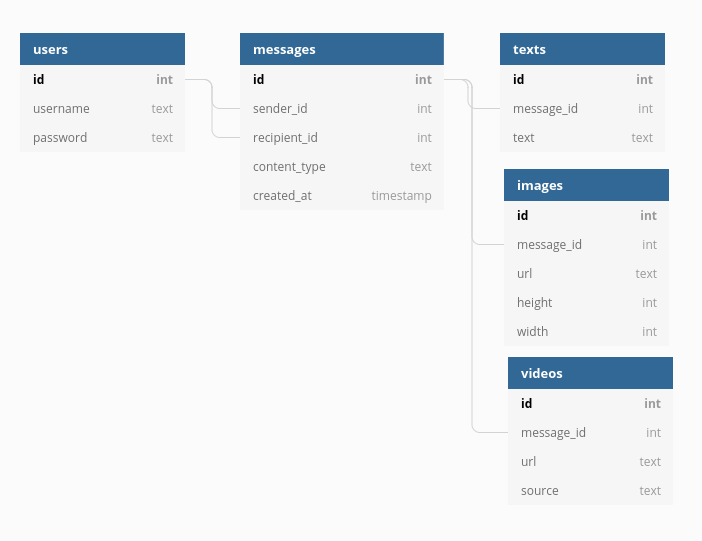

# ASAPP Chat Backend Challenge v1


### Overview

This is a Go based boilerplate which runs an HTTP Server configured to answer the endpoints defined in
[the challenge you received](https://backend-challenge.asapp.engineering/).
All endpoints are configured in cmd/server.go and if you go deeper to the handlers
for each route, you will find a _TODO_ comments where you are free to implement your solution.

### Instructions

They are located in the _docs/index.html_ file

### Prerequisites

- Go version >= 1.12.
- Docker
- SQLite3

### How to run it

`go run cmd/main.go`

Or you can use the Makefile

`make run`

To run tests:

`go test ./...`

### Build Docker image and run it

```
docker build -t challenge:latest .
docker run -dp 8080:8080 challenge:latest
```

### Kubernetes

`kubectl apply -f ./k8s/deployment.yml`

If you have installed something like Minikube or MicroK8s, you can run it locally

`kubectl port-forward <pod-name> 8080:8080`

### SQLite Migrations

If you don't want to use the dockerized version, you must execute migrations first. You can do it by running:

`make migrate`

#### Database schema



### Environment variables

If you want to run it locally and use a custom configuration, you can override it by generating a `.env` file based on the `env.sample` file.
